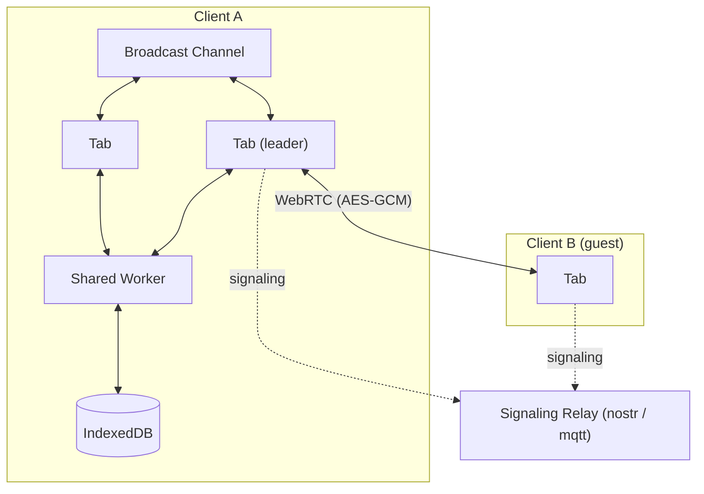

# erd-editor

> Entity-Relationship Diagram Editor

## [erd-editor.io](https://erd-editor.io)

- PWA support (works offline).
- Real-time collaboration.
- End-to-end encryption.
- Local-first support (autosaves to the browser).
- Real-time synchronization between browser tabs.

## [Document](https://docs.erd-editor.io)

- [Web App](https://erd-editor.io)
- [VSCode Extension](https://marketplace.visualstudio.com/items?itemName=dineug.vuerd-vscode)
- [IntelliJ Plugin](https://plugins.jetbrains.com/plugin/23594-erd-editor)
- [Editing Guide](https://docs.erd-editor.io/docs/category/guides)
- [API](https://docs.erd-editor.io/docs/api/erd-editor-element)
