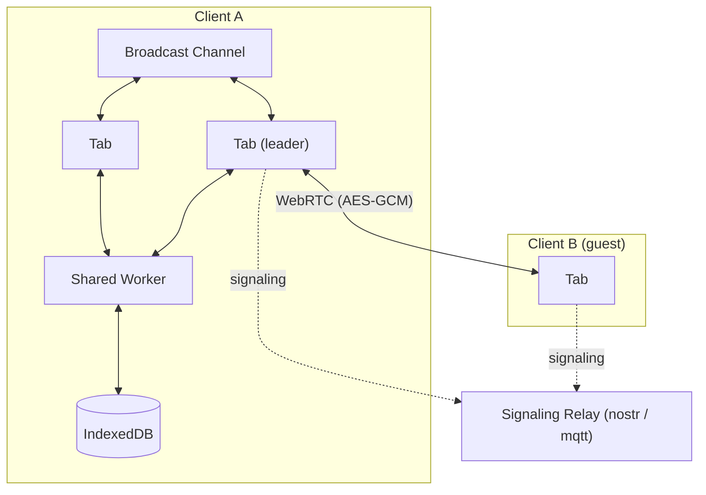

# erd-editor

> Entity-Relationship Diagram Editor


Design a database schema visually, import and export SQL DDL, and generate code from the
result — in the browser, in VS Code or IntelliJ, or embedded in your own page as a custom element.
One editor and one document format across all of them.

## Where to use it

| | Install | |
| --- | --- | --- |
| **Web app** | [erd-editor.io](https://erd-editor.io) | Installable PWA, works offline, real-time collaboration |
| **VS Code** | [Marketplace](https://marketplace.visualstudio.com/items?itemName=dineug.vuerd-vscode) | Opens `.erd.json` files in a custom editor |
| **IntelliJ** | [JetBrains Marketplace](https://plugins.jetbrains.com/plugin/23594-erd-editor) | Same, for IntelliJ-based IDEs |
| **Your app** | `npm install @dineug/erd-editor` | The framework-free `<erd-editor>` custom element |

To try it in an IDE, create an empty file with a `.erd.json` extension and open it.

## Features

- **Visual schema design** — tables, columns, memos, and four relationship cardinalities
  (zero-one, zero-N, one-only, one-N)
- **SQL DDL import** — point it at a `.sql` dump and get a diagram; the parser skips what it
  does not recognize, so an awkward dump imports partially rather than failing outright
- **SQL DDL export** — Databricks, MariaDB, MSSQL, MySQL, Oracle, PostgreSQL, SQLite
- **Code generation** — TypeScript, GraphQL, C#, Java, JPA, Kotlin, Scala, Go,
  SQLAlchemy, TypeORM
- **Visualization** — a force-directed view of how the tables actually relate
- **Export** — `.erd.json`, `.sql`, `.png`
- **Quick search**, **undo / redo**, keyboard shortcuts, and a theme builder
- **Real-time collaboration** (experimental) — peer-to-peer, end-to-end encrypted, with no
  backend holding your schema. Live on erd-editor.io; embedders get the same action stream
  through the element's `getSharedStore()`

## Embedding

```sh
npm install @dineug/erd-editor
```

```js
import '@dineug/erd-editor';

const editor = document.createElement('erd-editor');
// the editor fills its container, and a custom element is inline by default
Object.assign(editor.style, { display: 'block', width: '100%', height: '100vh' });
document.body.appendChild(editor);
```

It is a custom element, so it works from any framework or from none. See
[`packages/erd-editor`](./packages/erd-editor) for the element API, CDN usage and
attributes.

## Real-time collaboration

Open a schema on [erd-editor.io](https://erd-editor.io), start a session from the sidebar,
and share the link it gives you — anyone who opens it joins the room.

The session belongs to the host and lives in their browser: guests see the host's document but
nothing is stored on their side, and when the host closes their last tab the session ends. A guest
who wants to keep the diagram should export it first.

Sessions are peer-to-peer over WebRTC and encrypted with AES-GCM. A signaling relay
introduces the peers and never sees plaintext; the room's secret key lives in the URL
fragment, so it is never sent to a server. Within one browser, tabs elect a leader and
share a single connection.

<details>
<summary>Architecture</summary>



</details>

## Documentation

- [Documentation](https://docs.erd-editor.io)
- [Editing Guide](https://docs.erd-editor.io/docs/category/guides)
- [API](https://docs.erd-editor.io/docs/api/erd-editor-element)

## Packages

This is a pnpm workspace. The two packages published to npm are
[`@dineug/erd-editor`](./packages/erd-editor) (the editor itself) and
[`@dineug/erd-editor-shiki-worker`](./packages/erd-editor-shiki-worker) (optional syntax
highlighting). Everything else is internal.

<details>
<summary>All 14 packages</summary>

| Package | Description |
| --- | --- |
| [`erd-editor`](./packages/erd-editor) | The editor core — the `<erd-editor>` custom element |
| [`erd-editor-schema`](./packages/erd-editor-schema) | The `.erd.json` document format, parsers and LWW operators |
| [`erd-editor-shiki-worker`](./packages/erd-editor-shiki-worker) | Syntax highlighting off the main thread |
| [`schema-sql-parser`](./packages/schema-sql-parser) | Permissive DDL parser used for SQL import |
| [`r-html`](./packages/r-html) | The tagged-template rendering framework the editor is built on |
| [`vite-plugin-r-html`](./packages/vite-plugin-r-html) | JSX → tagged templates, plus HMR boundaries |
| [`shared`](./packages/shared) | Type guards and small helpers shared across the workspace |
| [`app`](./packages/app) | The React PWA at erd-editor.io |
| [`vscode-extension`](./packages/vscode-extension) | The published VS Code extension |
| [`vscode-webview`](./packages/vscode-webview) | The bundle inside the VS Code webview |
| [`vscode-bridge`](./packages/vscode-bridge) | Typed host ↔ webview command protocol |
| [`vscode-replication-store-worker`](./packages/vscode-replication-store-worker) | Headless document replica for the VS Code host |
| [`intellij-webview`](./packages/intellij-webview) | The bundle inside the IntelliJ plugin's editor panel |
| [`intellij-plugin`](./packages/intellij-plugin) | The published IntelliJ plugin — Kotlin and Gradle, not TypeScript |

</details>

## Development

Requires Node 22 (`.nvmrc` pins `22.23.2`) and pnpm `10.34.3`, which `packageManager` pins for you.
The IntelliJ plugin additionally needs a JDK; Gradle's toolchain resolver fetches JDK 21 if your
machine has none.

```sh
pnpm install
pnpm build            # build every package
pnpm test             # typecheck + unit tests
pnpm check            # format + lint + typecheck
pnpm format           # write formatting fixes
```

To run a single package, note that this workspace splits its command surface: build-style
tasks go through [Vite+](https://viteplus.dev/), whose `vp` binary `pnpm install` puts in
`node_modules/.bin`, and everything else is a package.json script.

```sh
pnpm exec vp run --filter @dineug/erd-editor --fail-if-no-match build   # a task
pnpm --filter @dineug/erd-editor dev                                    # a script
pnpm --filter @dineug/erd-editor-app dev                                # the web app
```

`intellij-plugin` is the exception — it is a Gradle project and declares neither, so its
commands are run from its own directory.

```sh
cd packages/intellij-plugin
./gradlew buildWebview   # the webview bundle it packages
./gradlew runIde         # a sandbox IDE with the plugin loaded
./gradlew buildPlugin    # the distributable zip
```

The Playwright and Extension Host suites are not part of `pnpm test`; CI runs them as separate
jobs.

```sh
pnpm --filter @dineug/erd-editor exec playwright install --with-deps chromium
pnpm --filter @dineug/erd-editor e2e   # also @dineug/r-html and @dineug/erd-editor-app
pnpm --filter vuerd-vscode e2e         # launches a real VS Code; prefix with `xvfb-run -a` on Linux
```

## Contributing

[Issues](https://github.com/dineug/erd-editor/issues) and pull requests are welcome. Commit
messages follow [Conventional Commits](https://www.conventionalcommits.org/) and are checked
by commitlint.

## License

[MIT](./LICENSE) © SeungHwan-Lee
