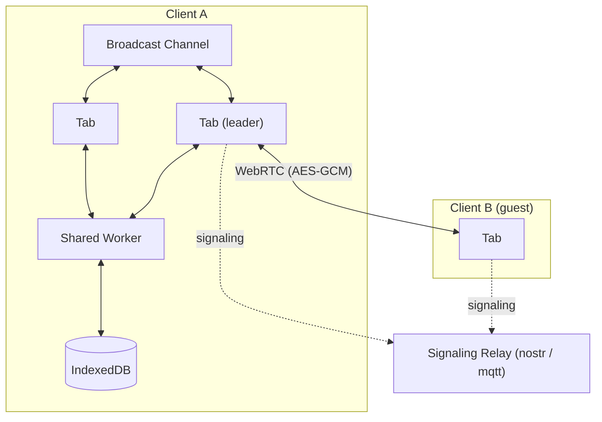

# app

> The React PWA at [erd-editor.io](https://erd-editor.io)

## [erd-editor.io](https://erd-editor.io)

- PWA support (works offline).
- Real-time collaboration (experimental).
- End-to-end encryption.
- Local-first support (autosaves to the browser).
- Real-time synchronization between browser tabs.

The React shell around the `<erd-editor>` custom element: diagrams are stored in IndexedDB
through a Comlink worker, tabs stay in sync over a BroadcastChannel, a Workbox service worker
serves the app offline, and collaboration runs peer-to-peer over WebRTC with no backend — the
relay carries signaling only, and the payload is encrypted with a key that never leaves the URL
fragment. Internal to the erd-editor monorepo; it is not published to npm.

## Structure



The pieces of that diagram live in `src/services/collaborative/` (WebRTC transport, plus the
`navigator.locks` leader election), `src/services/indexeddb/` (the Dexie service and its workers),
and `src/utils/broadcastChannel.ts` (the cross-tab bridge).

## Development

```sh
pnpm --filter @dineug/erd-editor-app dev        # builds workspace deps, then starts the dev server
pnpm --filter @dineug/erd-editor-app typecheck
pnpm --filter @dineug/erd-editor-app test:coverage
pnpm --filter @dineug/erd-editor-app e2e        # Playwright; also e2e:dev, e2e:headed, e2e:report

pnpm exec vp run --filter @dineug/erd-editor-app --fail-if-no-match build
pnpm exec vp run --filter @dineug/erd-editor-app --fail-if-no-match test
```
