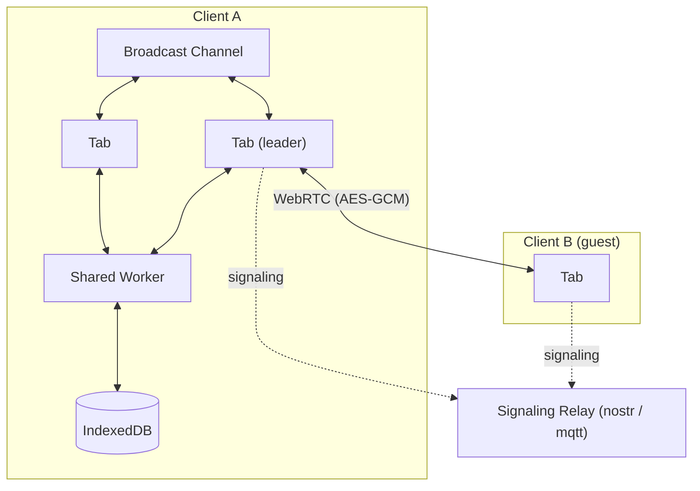

# erd-editor-app

> Web App

## [erd-editor.io](https://erd-editor.io)

- PWA support (works offline).
- Real-time collaboration.
- End-to-end encryption.
- Local-first support (autosaves to the browser).
- Real-time synchronization between browser tabs.

## Structure

