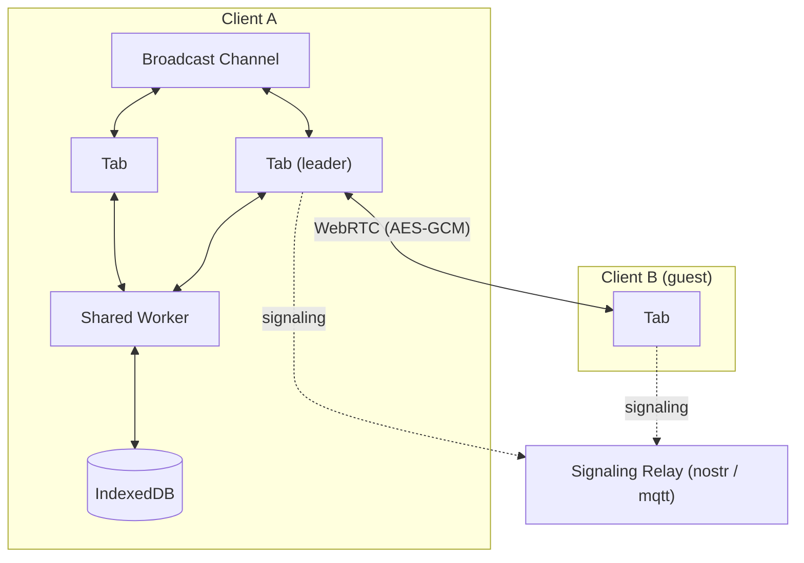

# app

> The React PWA at [erd-editor.io](https://erd-editor.io)

## [erd-editor.io](https://erd-editor.io)

- PWA support (works offline), with a prompt when a new version is ready instead of a reload.
- Real-time collaboration (experimental), with a list of who is in the session and their nicknames.
- End-to-end encryption.
- Local-first support (autosaves to the browser).
- Real-time synchronization between browser tabs.
- A schema list ordered by last edit, grouped by date (Today, Yesterday, Previous 7 Days, …), with search.
- A trash that deletes schemas permanently after 30 days, or when you empty it.
- Backup export and import of every schema, plus import of `.erd`, `.vuerd`, `.json`, SQL, DBML, AML and GraphQL files, from the menu or by dropping them anywhere, one import at a time: while one runs, Import files is disabled and a drop is refused; a SQL, DBML, AML or GraphQL file lands with its tables laid out by their relationships, in the Google Drive editor's import too.
- A link per schema: the open one is in the URL as `/?schema=<id>`.
- Light, dark or system theme.
- The editor in 25 languages, picked from its toolbar or command palette and shared by every tab; until you pick one it follows your browser's language, or English when it is not among them. The app's own screens stay in English.
- A welcome screen on an empty diagram, with its first steps: a new table or memo, import, the command palette and the shortcuts.
- A Google Drive editor at `/gdrive`, installed from the [Google Workspace Marketplace](https://workspace.google.com/marketplace/app/erd_editor/428467403360): it opens diagrams from Drive's Open with and New menus and saves back to the same file.

The React shell around the `<erd-editor>` custom element: diagrams are stored in IndexedDB
through a Comlink worker, tabs stay in sync over a BroadcastChannel, a Workbox service worker
serves the app offline, and collaboration runs peer-to-peer over WebRTC with no backend — the
relay carries signaling only, and the payload is encrypted with a key that never leaves the URL
fragment. Internal to the erd-editor monorepo; it is not published to npm.

## Structure


```mermaid
flowchart TB
    subgraph clientA["Client A"]
        bcA["Broadcast Channel"]
        tabA1["Tab (leader)"]
        tabA2["Tab"]
        swA["Shared Worker"]
        idbA[("IndexedDB")]

        bcA <--> tabA1
        bcA <--> tabA2
        tabA1 <--> swA
        tabA2 <--> swA
        swA <--> idbA
    end

    subgraph clientB["Client B (guest)"]
        tabB1["Tab"]
    end

    relay["Signaling Relay (nostr / mqtt)"]

    tabA1 <-->|"WebRTC (AES-GCM)"| tabB1
    tabA1 -. "signaling" .-> relay
    tabB1 -. "signaling" .-> relay
```

The pieces of that diagram live in `src/services/collaborative/` (WebRTC transport, plus the
`navigator.locks` leader election), `src/services/indexeddb/` (the Dexie service and its workers),
and `src/utils/broadcastChannel.ts` (the cross-tab bridge).

## Development

```sh
pnpm --filter @dineug/erd-editor-app dev        # builds workspace deps, then starts the dev server
pnpm --filter @dineug/erd-editor-app typecheck
pnpm --filter @dineug/erd-editor-app test:coverage
pnpm --filter @dineug/erd-editor-app e2e        # Playwright; also e2e:dev, e2e:headed, e2e:report

pnpm exec vp run --filter @dineug/erd-editor-app --fail-if-no-match build
pnpm exec vp run --filter @dineug/erd-editor-app --fail-if-no-match test
```
